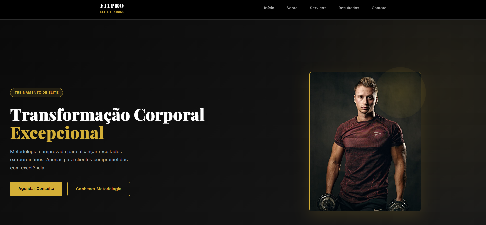

# 🚀 Projeto - Landing Page Profissional em HTML, CSS e JS

Este projeto apresenta uma **página web responsiva** desenvolvida com **HTML, CSS e JavaScript**, com foco em design limpo e interatividade para usuários de todos os dispositivos.

🔗 **Visite o site**:  
👉 [Meu Site](https://seu-site-aqui.vercel.app/)

## 📖 Sobre o projeto

- Página web criada para demonstrar funcionalidades interativas e layout moderno  
- Responsiva para **desktop, tablet e celular**  
- Inclui navegação dinâmica, menus, modais e carrosséis  

## 🛍️ Seções principais (Menu)

1. **Início** – Apresentação do projeto e informações principais  
2. **Sobre** – Estrutura e objetivos 
3. **Serviços** – Lista de serviços oferecidos  
4. **Resultados** – Exemplos de trabalhos, conquistas ou feedbacks  
5. **Contato** – Links diretos para email, WhatsApp e redes sociais  

## 💡 O que aprendi e implementei

- Estrutura com **HTML semântico**  
- Estilo e responsividade com **CSS3**  
- Funcionalidades interativas com **JavaScript**  
- Uso de imagens, ícones e links externos  

## 🛠️ Tecnologias utilizadas

  
  
  

## 📸 Captura de Tela

  

## 📲 Contato

Quer saber mais?  

- 🌐 LinkedIn: [palomagl](https://linkedin.com/in/palomagl)  
- Email: **palomalorenzon@gmail.com**  
- Instagram: [seu-perfil](https://instagram.com/_palomagl)  
- WhatsApp: [Clique para abrir](https://wa.me/+5551998127367)

---

Desenvolvido com cuidado e atenção por **Paloma Lorenzon**, aplicando HTML, CSS e JavaScript para criar um projeto funcional e moderno.
